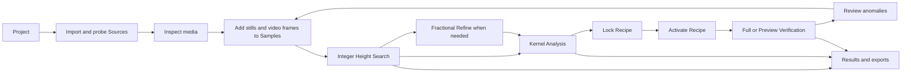

# Design

## Source of truth

- Status: Active implementation contract
- Last refreshed: 2026-07-31
- Primary product surfaces: Project Hub, Project Workspace, Media Inspector, Samples, Analysis Workbench, Whole-video Verification, Results, Settings and Diagnostics
- Evidence reviewed:
  - `docs/architecture.md`
  - `.omx/plans/standalone-getnative.md`
  - `README.md`
  - `app/src/App.tsx`
  - `app/src/App.css`
  - `upstream/muvsfunc/muvsfunc.py`
  - Local training sources `总监培训2026_20260725.html` and `总监培训2026_20260726.html` (research inputs; not distributed)
  - Local training scripts `test_getnative.vpy`, `test_getfnative.vpy`, `test_getfnative_v2.vpy`, `test_selectkernel.vpy`, and `check_descale.vpy` (research inputs; not distributed)
- Design assumption: Project is the top-level workspace. A quick one-off analysis is an untitled temporary Project that can be saved later.
- Confirmed product decisions:
  - First launch opens Project Hub.
  - Video inspection is a silent, precise frame browser; real-time playback and audio are not required.
  - A Project may save multiple Analysis Recipes, but at most one locked Recipe is active for new verification runs.
  - The UI supports Simplified Chinese and English. Simplified Chinese (`zh-CN`) is the default on first launch.
- Evidence boundary: the existing application is a dense three-pane prototype. Its visual structure is reusable, but source import, modes, charts, results, jobs, and export are not yet a complete user workflow.

## Workflow facts and derived constraints

The training scripts and `muvsfunc.getnative` establish three mutually exclusive computation shapes:

| Mode | Engine-valid input shape | Product page |
| --- | --- | --- |
| Height search | One Sample, one fixed kernel, multiple candidate heights | Height Analysis |
| Kernel search | One Sample, one fixed geometry, multiple candidate kernels | Kernel Analysis |
| Verification | Multiple frames, one fixed geometry, one fixed kernel | Whole-video Verification |

- Multi-Sample analysis is a UI-level `RunGroup` containing one engine-valid Run per Sample; it is not one oversized engine request.
- Comparing several kernels during Height Analysis creates parallel Height Runs in one `RunGroup`, each with one fixed kernel.
- Multi-video verification creates one VerificationRun per Source in one `RunGroup`; failures and cancellation remain source-local.
- Integer search is the coarse pass. Fractional search is an explicit refinement with `base_height` and, when needed, `base_width`/parity geometry.
- H-only and W-only are first-class axis modes. The product must not require the training script's transpose workaround for width analysis.
- A locked Recipe owns every semantic value that changes the metric: geometry, kernel, metric crop, pixel exclusion threshold, p-norm, compatibility profile, and math mode.
- Verification never edits Recipe semantics inline. Users change the active Recipe or derive and lock a new revision.
- Complete Verification evaluates every frame. I-picture-only and every-N-frame scans are explicitly incomplete Preview Scans.
- Legacy I-picture Preview means decoded picture type `I`, matching `_PictType == b"I"`; it is not silently treated as a generic container keyframe flag.
- Store raw metrics without plot epsilon. Add `1e-9` only in logarithmic rendering where zero cannot be displayed.
- Pixel Exclusion Threshold and Frame Review Threshold are different concepts and must never share a label or control.
- `test_getfnative*.vpy` uses MUF fractional geometry despite its filename; filenames never select a compatibility profile.

## Brand

- Personality: technical, exact, restrained, trustworthy, and fast to scan.
- Trust signals:
  - Never hide the active source, frame, recipe, backend, compatibility profile, or math mode.
  - Distinguish measured results from suggestions and user-confirmed decisions.
  - Show fallback, decoder, and backend reasons instead of silently changing behavior.
  - Preserve enough provenance to reproduce every result.
- Avoid:
  - Marketing-style landing content.
  - Decorative card grids and nested cards.
  - Treating a recommendation as an automatic truth.
  - Presenting placeholder curves or unavailable controls as working analysis.
  - Coined product labels, invented abbreviations, or newly fabricated translations when established training or industry terminology exists.
  - A monochrome green interface; use neutral surfaces plus semantic green, amber, red, and data-series colors.

## Product goals

- Goals:
  - Let users collect still images and selected video frames into one Project.
  - Make representative-frame selection precise without requiring VapourSynth or external scripts.
  - Support height search, kernel search, recipe locking, and whole-video verification as one continuous workflow.
  - Make integer coarse search, fractional refinement, and fixed-Recipe verification visibly distinct operations.
  - Let users return from an anomalous verification frame to focused analysis without reconstructing context.
  - Preserve analysis history and export reproducible results.
- Non-goals:
  - General-purpose video editing, transcoding, subtitle editing, or media library management.
  - Real-time video playback, audio playback, or replacing a desktop media player.
  - Automatically applying descale/rescale to produce a finished encode.
  - Silently choosing a final height or kernel on behalf of the user.
  - Copying source videos into the Project by default.
- Success signals:
  - A new user can import media, select samples, run a height search, run a kernel search, lock a recipe, and verify a video without leaving the application.
  - Every chart point can be traced to a source/sample, parameters, engine version, and backend.
  - Every Run sent to the engine satisfies exactly one documented computation shape; UI batching never weakens that contract.
  - Users can distinguish a complete all-frame verification from an I-picture/every-N Preview Scan without opening provenance details.
  - A verification anomaly can be added to Samples and re-analyzed in two actions or fewer.
  - Missing media, unavailable decoders, and failed jobs are recoverable without losing prior results.

## Personas and jobs

- Primary personas:
  - Experienced encoding staff who understand descale, rescale, kernels, parity, crop, and error plots.
  - Learners following the training workflow who need guardrails and visible parameter relationships.
- User jobs:
  - Inspect one or more still images for native-resolution evidence.
  - Select representative frames from one or more videos.
  - Compare height valleys across samples without losing per-sample differences.
  - Explore fixed kernels and Bicubic `b/c` parameter space.
  - Lock a reproducible recipe only after visual and metric review.
  - Scan a complete video with a fixed recipe and find anomalous frames.
  - Re-open a prior Project and understand how each conclusion was reached.
- Key contexts of use:
  - Long-running desktop analysis on macOS and Windows.
  - Large MKV sources whose formats may not be supported by the system WebView.
  - Multiple monitors and repeated keyboard-driven frame inspection.
  - Strict CPU comparison and optional GPU-accelerated exploration.

## Information architecture

### Primary navigation

When no Project is open:

- Project Hub: New Project, Open Project, and Recent Projects.

When a Project is open, use a persistent left navigation rail:

1. Overview
2. Media
3. Samples
4. Analyze
5. Verify
6. Results

Settings and Diagnostics belong to the application menu/title bar, not the Project navigation.

### Application shell

- Top title bar:
  - Project name and save state.
  - Undo/redo when project mutations support it.
  - Global job indicator.
  - Engine/backend status.
  - Export shortcut when the current page has exportable data.
- Left navigation rail:
  - Stable Project destinations with compact counts for sources, samples, running jobs, and anomalies.
- Main work area:
  - Page-specific split panes with stable dimensions.
- Bottom job tray:
  - Persistent queued/running/completed jobs across Project pages.
  - Expandable; not a page-blocking modal.
- Right inspector:
  - Contextual parameters or details for the selected source, sample, result, or anomaly.
  - Hidden when it has no meaningful content.

### Core routes/screens

| Route | Screen | Primary responsibility | Primary output |
| --- | --- | --- | --- |
| `/projects` | Project Hub | Create, open, and recover Projects | Open Project workspace |
| `/project/:id/overview` | Overview | Show workflow readiness and recent activity | Next recommended user action |
| `/project/:id/media` | Media | Import, probe, inspect, and select video frames | Ready sources and selected frame references |
| `/project/:id/samples` | Samples | Curate the analysis set | Ordered, valid sample set |
| `/project/:id/analyze/height` | Height Analysis | Search candidate dimensions and parity | Selected height geometry draft |
| `/project/:id/analyze/kernel` | Kernel Analysis | Compare kernels and Bicubic parameters | Selected kernel draft |
| `/project/:id/verify` | Whole-video Verification | Scan one or more videos with a locked recipe | Frame-error timeline and anomalies |
| `/project/:id/results` | Results | Review runs, recipes, provenance, and exports | Durable artifacts and comparisons |

Routes describe navigation state; implementation may use an internal router rather than web URLs.

### Content hierarchy

1. Current Project and source/sample identity.
2. Current workflow state and blocking prerequisites.
3. Primary visual evidence: preview, analysis plot, or verification timeline.
4. Parameters and provenance.
5. Secondary tables, diagnostics, and export actions.

## Page specifications

### 1. Project Hub

Purpose:

- Provide a functional project chooser, not a marketing landing page.

Layout:

- Compact toolbar with New Project and Open Project.
- Recent Projects table with name, last opened time, source count, active recipe, and missing-media state.
- Recovery row for an untitled autosaved Project when present.

Logic:

- New Project creates an empty Project and immediately opens Overview.
- Quick Analysis creates an untitled temporary Project and opens Media.
- Opening a Project validates its manifest before navigating.
- Missing source files do not block opening; they create a relink task.
- Remove-from-recents never deletes the Project file.

Empty/error states:

- No recent Projects: show only New and Open commands.
- Invalid manifest: show the exact validation problem and preserve the original file.
- Newer unsupported schema: open read-only when possible.

### 2. Project Overview

Purpose:

- Answer: what is in this Project, what has been decided, and what can the user do next?

Layout:

- Workflow status strip: Media -> Samples -> Height -> Kernel -> Active Recipe -> Verify.
- Source and sample summary as compact rows, not decorative cards.
- Analysis Recipes table with name, revision, lock state, updated time, and a single visible Active badge.
- Active recipe summary with Activate, Deactivate, Duplicate/Edit as New, and View commands as applicable.
- Recent jobs and results table.
- Visible blockers such as missing media, no samples, no active locked recipe, or an outdated recipe.

Logic:

- The primary command follows the first incomplete prerequisite.
- Workflow steps are clickable only when their prerequisites are met.
- A Project can contain several named Analysis Recipes.
- A Project has at most one active Recipe. Activating a locked Recipe atomically replaces the previous active Recipe.
- Activation is explicit; saving or locking a Recipe does not silently change which Recipe is used for verification.
- Starting verification requires the active Recipe to be locked. The run snapshots that Recipe ID rather than asking for a different per-run Recipe.
- Completed runs remain immutable; re-running creates a new run.

### 3. Media

Purpose:

- Import media, inspect technical metadata, and select video frames for analysis.

Layout:

- Left source list: images and videos with type icon, probe state, dimensions, and missing/unsupported state.
- Center media inspector:
  - Still image: image viewport with zoom, pan, pixel position, and optional crop overlay.
  - Video: decoded frame viewport, timeline, filmstrip, frame/time inputs, and frame-step controls.
- Right selection panel: samples already added from the active source.

Import behavior:

- Support file picker multi-select and drag-and-drop.
- Still images and videos may be added together.
- Source probing starts automatically after import.
- Do not ask for width or height for normal files; read media metadata.
- Manual metadata overrides are advanced diagnostics for raw/ambiguous sources only.
- Duplicate detection uses normalized path plus a source fingerprint; duplicates can be referenced once and sampled many times.

Still-image behavior:

- Still images have no frame count, timeline, or timestamp controls.
- Add Image to Samples creates a Sample referencing the Source.
- Animated image formats are classified explicitly as multi-frame media rather than silently treated as stills.

Video frame-picker behavior:

- The media surface is a silent, precise frame browser, not a real-time playback product.
- Timeline dragging shows a nearby decoded/keyframe preview; release requests an exact target frame.
- Provide previous/next frame, previous/next keyframe, direct frame-number input, and direct timestamp input.
- Store both sequential frame index and PTS/timebase for every selected frame.
- Mark already-selected frames on the timeline.
- Add Current Frame creates a Sample reference without exporting a PNG.
- Add Current Frame and Continue keeps the frame browser focused for repeated sampling.
- If frame count is unknown, show duration and timestamp while a precise index is built lazily.

Decoder behavior:

- Production probing and decoding use the bundled engine media backend.
- Ambient system `ffprobe` is not a production dependency.
- If video decode is unavailable, keep the Source entry and show a precise diagnostic; manual dimensions do not make the video analyzable.
- WebView `<video>` support must not determine supported production formats.

### 4. Samples

Purpose:

- Curate the exact still images and video frames used by analysis runs.

Layout:

- Dense table/list with thumbnail, label, source, frame/time when applicable, dimensions, tags, include state, and validation state.
- Preview pane for the selected sample.
- Bulk action toolbar for include/exclude, remove, tag, and reorder.

Logic:

- A Sample is a reference, not a copied image by default.
- Still samples omit all frame/time columns.
- Video samples show source, stream, frame index, and timestamp.
- Samples can be grouped by source or shown as a flat ordered analysis set.
- Removing a Sample never deletes its Source or prior immutable run results.
- Source fingerprint mismatch marks the Sample stale and blocks new runs until relinked or explicitly revalidated.
- Multi-sample analysis preserves each sample's curve. Aggregation, when enabled, is a separate clearly labeled derived series.

### 5. Height Analysis

Purpose:

- Find candidate native dimensions and parity behavior for the selected Samples.

Prerequisites:

- At least one valid included Sample.

Layout:

- Left sample list with visibility toggles and per-sample color swatches.
- Center plot with per-sample overlays, optional aggregate series, log/linear Y mode, zoom, and candidate tooltips.
- Right parameter inspector and ranked valleys table.
- Bottom job tray for progress and cancellation.

Parameters:

- Compatibility profile.
- Search preset: Integer Coarse, Fractional Refine, or Custom.
- H+W, H-only, or W-only.
- One fixed kernel per underlying HeightRun; Compare Common Kernels creates a grouped set of independent HeightRuns.
- Candidate min, max, step, endpoint rule, and resolved count, with integer, 0.1, and 0.25 presets.
- Base height appears only for fractional geometry; optional base width and parity controls appear only when the selected geometry mode needs them.
- Even/odd parity controls when using pro geometry.
- Metric crop, Pixel Exclusion Threshold, p-norm, math mode, backend, and device preference.

Logic:

- One engine HeightRun evaluates one Sample, one fixed kernel, and many heights. Multiple Samples or fixed kernels are represented by a RunGroup with one immutable curve per member Run.
- Before starting, show the resolved candidate count and work estimate: Samples x fixed kernels x candidate heights.
- Integer Coarse proposes a one-action Refine Around Selection transition that carries the selected neighborhood into a fractional grid without mutating the coarse result.
- Standard integer geometry derives width from the probed source aspect ratio; manual width is not required. W-only analysis uses the native W-only engine mode.
- Candidate values and endpoint semantics are previewable and serialized exactly; a displayed `0.1` must not hide legacy floating-grid behavior.
- Valley suggestions are ranked but never automatically accepted.
- Clicking a point selects it; Apply as Height Draft records its geometry in the current recipe draft.
- H-only and W-only results can be combined into one geometry draft only after both axes are explicitly selected.
- Changing parameters after a completed run marks the view dirty and starts a new Run/RunGroup; it does not mutate prior results.
- Changing MetricSpec makes the new result explicitly incompatible with prior curves until the user switches to a compatible comparison set.
- If samples disagree, show the disagreement; do not hide it behind an aggregate minimum.

### 6. Kernel Analysis

Purpose:

- Compare fixed kernel families and explore Bicubic `b/c` parameters after height geometry is known.

Prerequisites:

- A selected height geometry draft or locked height from an existing recipe.

Layout:

- Left sample visibility list shared with Height Analysis.
- Center view switches between:
  - Ordered kernel comparison curve.
  - Bicubic `b/c` heatmap with a linked cross-section plot.
- Right panel shows kernel family, parameter grid, ranked minima, and visual characteristics.

Parameters:

- Locked or selected Height Draft; geometry is read-only on this page.
- Mode: Preset Families or Bicubic Grid.
- Preset Families: Bilinear, named Bicubic presets, Lanczos taps, and supported Spline variants.
- Bicubic Grid: `b` start/end/step and `c` start/end/step with resolved candidate count and endpoint semantics.
- MetricSpec inherited from the selected Height result by default; changing it requires an explicit New Metric Variant action.
- Math mode, backend, and device preference.

Kernel families:

- Bilinear.
- Bicubic with explicit `b` and `c`.
- Lanczos with taps.
- Spline variants supported by the engine.

Logic:

- Preset comparison and Bicubic grid exploration are separate modes within this page.
- Bicubic grid defaults may mirror the training workflow (`b` and `c` from 0 to 1 at 0.1), but remain editable.
- One engine KernelRun evaluates one Sample, one fixed geometry, and many kernels. Multiple Samples create a RunGroup of independent KernelRuns.
- The candidate sequence is shown before execution; compatibility profiles may preserve repeated-addition semantics while the UI displays canonical decimal labels.
- Selecting a candidate shows its per-sample errors and expected sharpness/ringing position without claiming visual safety.
- Apply as Kernel Draft updates the recipe draft.
- Lock Recipe requires confirmed geometry and kernel plus all metric/crop parameters.
- If Height and Kernel results use different MetricSpecs, Lock Recipe is blocked until the user chooses which MetricSpec the Recipe owns and acknowledges that the other result is not directly comparable.
- Locking saves a named immutable Recipe; Activate for Verification is a separate explicit action.
- Editing a locked Recipe creates a new draft linked to the original Recipe. Locking that draft creates a new Recipe revision instead of mutating the original.

### 7. Whole-video Verification

Purpose:

- Apply the Project's active locked Recipe to every frame of a chosen video and surface frames that deserve review.

Prerequisites:

- One or more ready video Sources.
- One active locked Recipe.

Layout:

- Setup strip with Source multi-select, Full/Preview segmented mode, optional frame/time range, backend preference, and Start command.
- Header strip with active locked Recipe summary and a Change Active Recipe command; Recipe semantic fields are read-only.
- Main frame-error timeline with log/linear mode, zoom, range selection, and progress overlay.
- Right review table with frame, timestamp, raw metric, review-rule match, tags, and review state.
- Frame preview synchronized with timeline selection.

Logic:

- Full Verification evaluates every frame in the selected range and is the default.
- Preview Scan supports Legacy I-picture Only and Every N Frames. Preview results always display an Incomplete Coverage badge and the exact scanned/eligible frame counts.
- Custom scope accepts frame or timestamp in/out values, resolves them to exact frame boundaries, and records both representations.
- Selecting multiple Sources creates one VerificationRun per Source inside one RunGroup. No video is concatenated with another video for execution or result identity.
- Start Verification snapshots the current `active_recipe_id` into the new VerificationRun.
- Switching the Project's active Recipe after a run starts never changes that running or completed run.
- Pixel Exclusion Threshold comes from the Recipe and cannot be edited here. Frame Review rules operate on stored frame metrics and may be changed after completion without recomputation.
- Absolute review thresholds and Top N filters are supported. Top Percent remains a product decision, and relative deviation is withheld until its baseline formula is explicitly defined.
- Raw per-frame metrics are retained. Log view applies display epsilon only at render time.
- High-error credits, text, or scene changes are not silently discarded. Users may tag or exclude ranges while preserving the original result.
- Clicking a timeline point loads the exact frame preview.
- Add to Samples creates a Sample from the selected anomaly and links back to the VerificationRun.
- Re-analyze opens Height or Kernel Analysis with that Sample selected.
- Cancel preserves completed frame results and records the run as partial.
- Resume is allowed only when source fingerprint, stream, resolved scope, frame-selection rule, Recipe, decode policy, engine compatibility, and prior partial result still match.

### 8. Results

Purpose:

- Review immutable runs and recipes, compare conclusions, and export artifacts.

Layout:

- Runs table with type, source/sample set, recipe, status, engine/backend, started time, and duration.
- Detail inspector containing parameters, provenance, warnings, and linked parent/child runs.
- Comparison view for compatible Height, Kernel, or Verification runs.

Logic:

- Results are append-only; deletion moves an artifact to Project trash and does not rewrite history.
- A recipe may be superseded but remains attached to historical runs.
- Changing the active Recipe never rewrites a historical VerificationRun or its result provenance.
- Compatible comparison requires matching semantic inputs for the compared axis: Source/Sample fingerprints, geometry, MetricSpec, profile, math mode, and candidate or frame-selection semantics as applicable.
- Results with different Pixel Exclusion Thresholds, crops, p-norms, or raw-vs-epsilon handling are never overlaid as if directly comparable.
- RunGroup rows can expand into source/sample member Runs so batch convenience never obscures failures or provenance.
- Export formats are enabled by result type:
  - JSON for complete structured provenance.
  - CSV/TXT for candidate or frame metrics.
  - SVG/PNG for plots.
- Export always states whether a run is complete, partial, cancelled, or based on preview sampling.

### 9. Settings and Diagnostics

Purpose:

- Make runtime capability and recovery information available without crowding analysis pages.

Sections:

- Interface language: Simplified Chinese and English; Simplified Chinese is the first-launch default.
- Engine version and path.
- Bundled media backend and FFmpeg build/version.
- Available decoders and supported media types.
- CPU, Metal, and CUDA devices with strict/fast capability.
- Cache location and size.
- Project autosave and recovery location.
- Diagnostic log export.

Logic:

- Language changes apply without restarting, persist as an application preference, and never alter Project data or Run provenance.
- Missing optional GPU support is informational.
- Missing media decode support is blocking only for affected media types.
- Clear Cache never deletes source media, Project manifests, locked recipes, or result records.

## Domain model

### Project

- Identity, name, schema version, created/updated timestamps.
- References to Sources, Samples, Recipes, RunGroups, Runs, Artifacts, review annotations, and UI state.
- `active_recipe_id: RecipeId | null`; it may reference only one locked Recipe in the same Project.
- Autosave metadata and recovery state.

### Source

- Kind: still image, animated image, or video.
- External path plus fingerprint; source media is not copied by default.
- Probe metadata: streams, dimensions, color, timebase, duration, and decoder information.
- State: Added -> Probing -> Ready, Unsupported, Missing, or Error.

### Sample

- Kind: still or video frame.
- Still reference: `source_id`.
- Video reference: `source_id + stream_id + frame_index + pts + timebase`.
- User label, tags, include state, order, and origin link.

### CandidateGridSpec

- Axis or parameter name, decimal start, decimal stop, decimal step, and endpoint rule.
- Compatibility grid semantics plus the fully resolved candidate sequence or its content hash.
- Preset identity when created from Integer Coarse, Fractional Refine, or Bicubic Grid presets.

### MetricSpec

- Metric crop: left, right, top, and bottom.
- Pixel Exclusion Threshold applied before reduction.
- Positive integer p-norm.
- Raw metric storage contract; plot epsilon is never part of MetricSpec.
- Profile-controlled border sampling and pre-metric crop behavior belong here when they change semantic pixels rather than display.

### Analysis Recipe (Recipe / 分析方案)

- A complete, reproducible parameter set confirmed by the user after Height and Kernel analysis.
- Geometry: active dimensions, canvas dimensions, offsets, parity, and axes.
- Kernel and parameters.
- A complete MetricSpec.
- Compatibility profile and math mode.
- State: Draft -> Locked -> Superseded.
- A locked Recipe is immutable.
- Activation is Project state, not Recipe lifecycle state. Multiple locked Recipes may be saved, but only the Recipe referenced by `Project.active_recipe_id` is active for new verification runs.
- Editing a locked Recipe creates a derived draft with a parent/revision link; locking it creates a new Recipe ID.
- A Draft or Superseded Recipe cannot be newly activated.
- Deleting or moving the active Recipe to trash requires first deactivating it or atomically activating a replacement.
- Runtime device, engine version, and timing belong to Run provenance rather than changing the Recipe's semantic parameters.

### AnalysisRun

- Type: Height or Kernel.
- Input Sample IDs and fingerprints.
- Exactly one engine-valid computation shape: one Sample plus one fixed kernel/many heights, or one Sample plus one fixed geometry/many kernels.
- CandidateGridSpec or ordered kernel candidate set and raw metric series.
- Derived suggestions and explicit user selection.
- Engine/backend/provenance and job status.

### RunGroup

- UI-level grouping for related independent Runs created by one user command.
- Type: Multi-Sample Height, Multi-Kernel Height, Multi-Sample Kernel, or Multi-Source Verification.
- Shared intent and parameter snapshot plus ordered member Run IDs.
- Aggregate progress is derived from member Runs; cancellation and failure remain addressable per member.

### VerificationRun

- Video Source ID and the locked Recipe ID snapshotted from `Project.active_recipe_id` when the run is created.
- ScanScope: stream, full/custom range, and frame-selection rule (`all`, decoded I-picture, or every N).
- Coverage: eligible frame count, scanned frame count, skipped frame count, and completion classification.
- Per-frame index, PTS, timestamp, metric, and processing status.
- Decode/color provenance and completion state.

### VerificationReview

- Mutable annotations layered over an immutable VerificationRun.
- Absolute threshold, Top N filter, tags, reviewed state, and user-excluded ranges. Top Percent is added only if the open product decision approves it.
- Recomputing review matches never recomputes or mutates raw frame metrics.

### Artifact

- Structured result, metric table, plot, thumbnail, or diagnostic export.
- Hash, producing Run ID, format, and generated time.

## Parameter ownership

| Parameter family | Edited in | Snapshotted by | Notes |
| --- | --- | --- | --- |
| File path, fingerprint, stream, probed dimensions, timebase, color metadata | Media | Source and every consuming Run | Normally probed; explicit overrides are diagnostics |
| Selected still/frame, frame index, PTS, tags, include state | Media/Samples | AnalysisRun | A Sample is a stable reference, not an exported PNG requirement |
| Height candidate grid, fixed kernel, axes, MetricSpec, backend preference | Height Analysis | HeightRun | One fixed kernel per engine Run |
| Fixed geometry, kernel candidate sequence, MetricSpec, backend preference | Kernel Analysis | KernelRun | One fixed geometry per engine Run |
| Selected geometry, selected kernel, MetricSpec, profile, math mode | Recipe review/editor | Locked Recipe | Immutable after locking |
| Video Sources, scope, frame-selection rule, execution backend/device | Verify setup | VerificationRun | Recipe semantics remain read-only |
| Review threshold, Top N, tags, reviewed/excluded state | Verify review | VerificationReview | Top Percent is deferred; review changes do not rerun analysis |
| Log/linear mode, zoom, visible series, table sort | Page view state | Optional UI state only | Never changes stored metrics |

Internal scheduler choices such as tile size, worker count, buffer size, `rt_eval`, and cache policy are diagnostics/provenance, not normal user parameters.

## Workflow and state logic

Global job states:

`Queued -> Preparing -> Running -> Completed | Partial | Cancelled | Failed`

Rules:

- Jobs use immutable input snapshots.
- UI batching creates a RunGroup of engine-valid member Runs; it never combines mutually exclusive computation shapes into one Run.
- Editing Project selections never changes a running or completed job.
- Changing `active_recipe_id` never changes the Recipe snapshot stored by an existing VerificationRun.
- Cancelling is explicit and recoverable where the backend supports resume.
- A backend fallback requires a visible warning and creates distinct provenance.
- Navigation does not cancel work.

## Design principles

- Project context before tool mode:
  - Users should always know which source, sample set, and recipe they are acting on.
- Evidence before recommendation:
  - Plots and per-sample metrics precede valley or anomaly suggestions.
- Progressive technical depth:
  - Common searches are compact; parity, base-width, p-norm, and decoder diagnostics remain available without dominating the default view.
- Preserve disagreement:
  - Multiple samples stay independently inspectable; aggregation never erases contrary evidence.
- Long-running work remains navigable:
  - Jobs persist across pages, expose progress/cancel, and never block unrelated inspection.
- Exactness over simulated familiarity:
  - Use an engine-decoded frame browser rather than a misleading WebView player that supports only a subset of target media.

## Visual language

- Color:
  - Neutral near-black/charcoal surfaces for the primary desktop workspace.
  - Green for ready/success and the primary selected series.
  - Amber for warnings, draft decisions, and selected comparison points.
  - Red for blocking errors only.
  - Multiple distinct chart-series colors with accessible contrast.
- Typography:
  - System UI sans serif for controls and labels.
  - Monospace for dimensions, timestamps, frame indices, metric values, kernel parameters, and IDs.
  - Compact headings appropriate to tool panels; no hero typography.
- Spacing/layout rhythm:
  - 4/8 px rhythm.
  - Dense tables and toolbars with clear grouping.
  - Stable split-pane widths; results and labels must not resize the analysis canvas unexpectedly.
- Shape/radius/elevation:
  - 4-6 px radii for controls and panels.
  - Borders and surface changes instead of floating page cards.
  - Elevation reserved for dialogs, menus, tooltips, and detached overlays.
- Motion:
  - Short state transitions only.
  - No decorative animation.
  - Timeline scrubbing and plot selection prioritize immediate response.
- Imagery/iconography:
  - Lucide icons already used by the application.
  - Real decoded frames and source thumbnails are the primary visual media.

## Components

- Existing components to reuse:
  - Dense application shell and split-pane proportions from `app/src/App.tsx` and `app/src/App.css`.
  - Existing field, segmented-control, engine-state, and job-bar visual language.
- New/changed components:
  - `ProjectShell`
  - `ProjectNavigator`
  - `SourceList`
  - `MediaInspector`
  - `FrameTimeline`
  - `FrameStepper`
  - `SampleTable`
  - `SampleVisibilityList`
  - `SearchPresetControl`
  - `CandidateGridSummary`
  - `WorkEstimate`
  - `MetricSpecEditor`
  - `AnalysisParameterInspector`
  - `MultiSeriesAnalysisPlot`
  - `KernelComparisonPlot`
  - `BicubicHeatmap`
  - `ValleyTable`
  - `RecipeSummary`
  - `RecipeReviewDialog`
  - `RecipeManager`
  - `VerificationSetupBar`
  - `CoverageBadge`
  - `VerificationTimeline`
  - `VerificationReviewTable`
  - `ReviewRuleEditor`
  - `RunGroupTable`
  - `GlobalJobTray`
  - `ExportDialog`
  - `DiagnosticsPanel`
- Variants and states:
  - Source: probing, ready, unsupported, missing, error.
  - Sample: included, excluded, stale, invalid.
  - Recipe lifecycle: incomplete draft, ready-to-lock, locked, superseded; locked Recipes also render as active or inactive from Project state.
  - Run: queued, preparing, running, completed, partial, cancelled, failed.
  - Coverage: full, preview-I-picture, preview-stride, custom-range, partial.
  - Plot: empty, loading, partial-stream, complete, incompatible comparison.
- Token/component ownership:
  - Extend the current CSS token and component approach before creating a new design-system layer.
  - Do not add a component framework solely for this redesign.

## Accessibility

- Target standard: WCAG 2.2 AA for desktop application surfaces.
- Keyboard/focus behavior:
  - All navigation, sample actions, plot point selection, frame stepping, and dialogs are keyboard accessible.
  - Arrow keys step frames when the frame viewport is focused.
  - Focus remains stable when streamed results update.
- Contrast/readability:
  - Chart series are distinguishable by color and line/marker treatment.
  - Small technical labels maintain AA contrast.
- Screen-reader semantics:
  - Plots provide an equivalent data table and selected-point announcement.
  - Job progress uses determinate progress semantics where possible.
  - Timeline markers expose frame, timestamp, metric, and review state.
- Reduced motion and sensory considerations:
  - Respect reduced-motion preference.
  - Never use color alone for status or anomaly severity.

## Responsive behavior

- Supported breakpoints/devices:
  - Primary: desktop windows at 1280x720 and above.
  - Supported compact desktop: approximately 900 px wide.
  - Mobile is not a target.
- Layout adaptations:
  - Wide: navigation rail + source/sample pane + main view + right inspector.
  - Medium: collapse navigation to icons and make the right inspector a toggleable drawer.
  - Compact: one primary work pane, with source/sample and result panes as mutually exclusive drawers.
- Touch/hover differences:
  - Hover tooltips have keyboard-focus equivalents.
  - Timeline targets and frame controls remain at least 32 px on desktop and 40 px when touch input is detected.

## Interaction states

- Loading:
  - Source probing, thumbnail generation, exact-frame decode, and analysis are distinct states.
  - Existing results remain visible while a new immutable run is executing.
  - RunGroup progress shows completed/running/failed member counts and never implies a failed member succeeded.
- Empty:
  - Each page states only the missing prerequisite and exposes its direct command.
- Error:
  - Keep the failed object in context and show actionable diagnostic details.
  - Decoder/backend failures identify source, operation, backend, and retry options.
- Success:
  - Update the affected table/timeline and preserve current selection.
  - Avoid modal success confirmations for routine completion.
- Disabled:
  - Disable commands only when a prerequisite is objectively missing; expose the reason through accessible description/tooltip.
  - Capability-gated pages may render their structure and prior results, but unavailable engine commands cannot present runnable controls or fabricated output.
- Offline/slow network:
  - Core analysis is local and must not require network access.
  - No cloud-dependent empty or loading state.

## Content voice

- Tone: concise, technical, neutral, and explicit about uncertainty.
- Language support:
  - Ship complete Simplified Chinese (`zh-CN`) and English (`en`) interfaces from the first release.
  - Use Simplified Chinese on first launch unless a persisted application preference already exists.
  - Language is an application preference, not a Project property; switching language must not change computation, stored values, identifiers, or exported numeric data.
- Terminology authority:
  - No coined terminology (`禁止生造字词`). Do not invent product labels, abbreviations, portmanteaus, or translations merely to make copy shorter or sound more branded.
  - When a concept appears in `总监培训2026_20260725.html` or `总监培训2026_20260726.html`, prefer the wording already used there for the corresponding locale.
  - Preserve canonical spellings for `getnative`, `descale`, `Bicubic`, `Bilinear`, `Spline`, and `Lanczos`; do not transliterate or rename them.
  - Source vocabulary observed in both HTML files includes `原生分辨率`, `误差`, `阈值`, and `扫描`. Use these established words in Simplified Chinese UI where their meanings match.
  - If neither HTML contains the required concept, use established video, encoding, or desktop-software terminology and record the bilingual mapping before the copy ships. Do not create a new word.
  - When the two sources use variants, keep one established term as the display label and record the other as a search/help alias; never blend them into a newly coined term.
- Terminology:
  - `Source`, `Sample`, `Recipe`, `Run`, and `RunGroup` are stable internal domain names. Their visible labels come from the approved bilingual terminology mapping rather than raw identifiers.
  - Internal `Sample` means a still image or selected video frame used in analysis.
  - Internal Analysis Recipe, displayed as `分析方案` in the Simplified Chinese UI, means a complete reproducible parameter set confirmed by the user.
  - Height Analysis, Kernel Analysis, and Whole-video Verification are internal workflow names in this document, not automatically approved display copy.
  - Suggestion, Selected, and Locked are distinct internal states; localized labels must preserve those distinctions.
  - Pixel Exclusion Threshold and Frame Review Threshold are distinct internal concepts; localized labels must not collapse them into one generic threshold.
  - Full Verification means every eligible frame, while Preview Scan means I-picture or stride sampling; localized labels must preserve the coverage distinction and prefer the source term `扫描` where appropriate.
- Microcopy rules:
  - Every navigation label, command, tooltip, validation message, empty state, error, status, table header, and accessibility label has both `zh-CN` and `en` text.
  - Do not build sentences by concatenating translated fragments. Each locale owns a complete phrase with placeholders.
  - Do not mix Chinese and English in one UI phrase except for canonical technical names, file formats, code values, and user-provided content.
  - Do not call a suggested valley Best until the user selects it.
  - State whether a result is complete, partial, preview-sampled, cancelled, or stale.
  - Always state coverage as scanned frames / eligible frames for Preview and partial results.
  - Keep kernel names and numeric parameters literal.
  - Never hide fallback or inferred color metadata behind generic status text.

## Implementation constraints

- Framework/styling system:
  - Tauri 2, React, TypeScript, and repo-native CSS.
  - Rust owns typed application/engine commands and events.
  - C++ engine owns probe, decode, analysis, and export computation.
- Design-token constraints:
  - Preserve current compact control scale and 4-6 px radius language unless usability testing disproves it.
  - Introduce semantic tokens for status and multi-series chart colors before expanding screens.
- Performance constraints:
  - Do not send full-resolution frame streams through JSON.
  - Generate bounded preview frames/thumbnails through an engine-owned cache or binary asset path.
  - Timeline updates and progress events must not resize the workspace.
  - Virtualize long source, sample, run, and anomaly lists.
- Compatibility constraints:
  - Production video support comes from the bundled media backend, not WebView codecs or ambient `ffprobe`.
  - CPU remains the deterministic fallback.
  - Missing optional GPU support never blocks Project access.
  - Project source references must support relinking after external files move.
- Localization constraints:
  - All user-facing React strings use locale resource keys; visible copy is not hard-coded in components.
  - `zh-CN` and `en` resources have identical key coverage. Missing keys fail development/CI checks instead of silently shipping a mixed-language UI.
  - Rust and C++ return stable error/status codes plus structured values. React owns localized user-facing messages; raw diagnostics remain separately inspectable.
  - Layouts reserve enough width for both supported locales and wrap labels without clipping controls or data.
- Project persistence assumptions:
  - Store a versioned Project manifest plus cache/results directories.
  - Reference source media externally by default.
  - Cache contents are rebuildable and may be cleared independently.
  - Locked Recipes and structured result records are not cache.
- Test/screenshot expectations:
  - Verify key pages in both `zh-CN` and `en` at wide and compact desktop widths.
  - Test first-launch `zh-CN`, language switching, preference persistence, resource-key parity, and the absence of untranslated or mixed-language UI copy.
  - Test still-only Projects, video-only Projects, mixed Projects, missing media, unsupported media, partial verification, and relink flows.
  - Test single-active-Recipe enforcement, atomic activation replacement, active Recipe removal guards, and historical run stability after activation changes.
  - Test the three computation-shape guards and verify that UI batches create separate RunGroup members.
  - Test integer-to-fractional refinement, exact decimal candidate previews, and incompatible MetricSpec comparisons.
  - Test Full, decoded-I-picture, every-N, custom-range, partial, cancelled, and resumed verification coverage.
  - Test that changing VerificationReview rules does not invoke analysis or change raw metrics.
  - Validate keyboard frame stepping and chart/table equivalence.
  - Use synthetic redistributable fixtures for stable screenshots and interaction tests.

## Current UI migration

- Keep:
  - Dense three-pane workbench proportions.
  - Analysis plot as the dominant center surface.
  - Compact parameter inputs, segmented axis control, result rows, and engine status.
- Change:
  - Replace top-level Height/Kernel/Verify/Batch tabs with Project navigation.
  - Keep Height and Kernel as subroutes/tabs inside Analyze.
  - Make Verify a dedicated page because its primary axis is video time/frame, not candidate height/kernel.
  - Treat batch as a property of Sample selection and the global job queue, not a separate analysis page.
  - Move source picking from per-run parameters into Project Media.
  - Replace manual width/height with probed read-only metadata for normal files.
  - Replace the geometry Preview command with workflow-specific Run Height Search, Run Kernel Search, and Start Verification commands.
  - Replace synthetic curves and valleys with immutable Run data.
  - Expand the current jobs bar into the persistent Global Job Tray.
  - Use `docs/gui-development-spec.md` as the staged implementation handoff; when it conflicts with this file, `DESIGN.md` wins.

## Open questions

- [ ] Product owner: For multiple Samples, should an aggregate suggestion default to median, trimmed mean, or remain off until explicitly enabled? Impact: curve interpretation and recipe recommendations.
- [ ] Product owner: Should a Project be a visible directory bundle or a single-file package abstraction? Impact: portability, cache management, and user expectations.
- [ ] Product owner: Which still formats are required for v1 beyond PNG/JPEG/TIFF? Impact: decoder inventory and color-management UI.
- [ ] Product owner: Should the first release include Top Percent review filtering in addition to absolute threshold and Top N? Impact: review-control density and result reproducibility.
- [ ] Engineering: Which bundled-decoder signal is proven equivalent to legacy `_PictType == b"I"` on the validation corpus? Impact: naming and compatibility claim for Legacy I-picture Preview.
